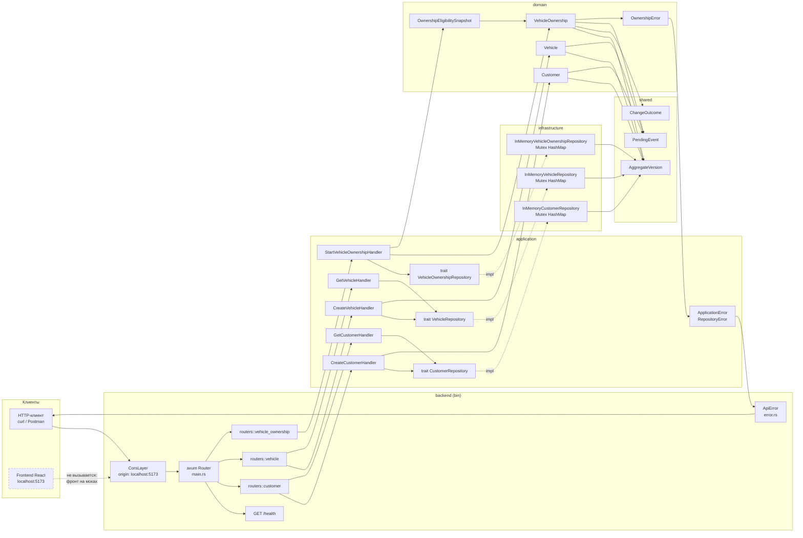

# 01. Обзор системы

## Назначение

Показать сквозной путь запроса через все слои: от HTTP-клиента до доменного
агрегата и обратно. Это входная точка в набор диаграмм — остальные файлы
детализируют отдельные её участки.

## Что представлено

Все шесть реализованных HTTP-маршрутов, слой приложения, порты репозиториев,
in-memory-адаптеры, доменные агрегаты и разделяемое ядро. Внешние системы
показаны только существующие.

## Как читать

Слева направо — направление потока запроса. Направление **зависимостей**
противоположно на участке порт/адаптер: `infrastructure` зависит от
`application`, а не наоборот (см. [06_dependency_graph.md](06_dependency_graph.md)).

Пунктир означает связь, заложенную в коде, но не задействованную.

## Реализованные маршруты

| Метод | Путь | Обработчик | Слой приложения |
|---|---|---|---|
| GET | `/health` | `health` | — (не проходит через слои) |
| POST | `/customers` | `create_customer` | `CreateCustomerHandler` |
| GET | `/customers/{id}` | `get_customer` | `GetCustomerHandler` |
| POST | `/vehicles` | `create_vehicle` | `CreateVehicleHandler` |
| GET | `/vehicles/{id}` | `get_vehicle` | `GetVehicleHandler` |
| POST | `/vehicles/{vehicle_id}/ownerships` | `create_vehicle_ownership` | `StartVehicleOwnershipHandler` |
| GET | `/vehicles/{vehicle_id}/ownerships/{ownership_id}` | `get_vehicle_ownership` | `GetVehicleOwnershipHandler` |

## Внешние системы

**Их нет.** Ни базы данных, ни брокера сообщений, ни внешних HTTP-сервисов.
Всё состояние живёт в `HashMap` внутри процесса и теряется при перезапуске.

Про фронтенд: в `main.rs` настроен CORS на `http://localhost:5173`, то есть
связь подготовлена. Но `frontend/src/features/*/api/*.ts` — это моки с
`setTimeout`, а `apiFetch` из `shared/api/client.ts` не вызывается ни из
одного места. Поэтому стрелка от фронтенда пунктирная: **сейчас React-часть
и Rust-часть не общаются**.
