# 02. Структура воркспейса

## Назначение

Показать физическую организацию Cargo-воркспейса: какие крейты существуют,
что в каждом лежит и в каком направлении между ними идут зависимости.

## Что представлено

Пять крейтов из `[workspace] members = ["backend", "crates/*"]` и их
внутреннее содержимое до уровня модулей.

## Как читать

Сверху вниз — от внешнего кольца гексагона к внутреннему. Стрелка `A --> B`
читается «A зависит от B». Обратите внимание, что стрелки никогда не идут
снизу вверх: `domain` не знает ни о ком, кроме `shared`.

```mermaid
flowchart TD

  subgraph w["Cargo workspace"]

    subgraph be["backend (bin, edition 2024)"]
      be_main["main.rs<br/>AppState, Router, health"]
      be_err["error.rs<br/>ApiError"]
      be_rt["routers/<br/>customer, vehicle, vehicle_ownership"]
    end

    subgraph inf["infrastructure (lib, edition 2024)"]
      inf_c["customer_repository.rs"]
      inf_v["vehicle_repository.rs"]
      inf_o["vehicle_ownership_repository.rs"]
      inf_t["tests/<br/>3 модуля"]
    end

    subgraph ap["application (lib, edition 2024)"]
      ap_c["customer/<br/>commands, ports, handlers"]
      ap_v["vehicle/<br/>commands, ports, handlers"]
      ap_o["ownership/<br/>commands, ports, handlers"]
      ap_e["error.rs<br/>ApplicationError, RepositoryError"]
      ap_t["tests/<br/>3 модуля с моками"]
    end

    subgraph dm["domain (lib, edition 2021)"]
      dm_c["customer/<br/>aggregate, state, event, error, permit"]
      dm_v["vehicle/<br/>aggregate, state, event, error, permit"]
      dm_o["vehicle_ownership/<br/>aggregate, state, event, error, snapshot"]
      dm_i["ids.rs<br/>CustomerId, VehicleId, VehicleOwnershipId"]
    end

    subgraph sh["shared (lib, edition 2021)"]
      sh_a["aggregate.rs<br/>AggregateVersion, ChangeOutcome"]
      sh_e["event.rs<br/>PendingEvent, EventEnvelope"]
      sh_au["audit.rs<br/>ActionContext, RoleSnapshot"]
      sh_i["ids.rs<br/>define_id!, ActorId и др."]
    end

  end

  be --> ap
  be --> inf
  be --> dm
  inf --> ap
  inf --> dm
  inf -.->|"объявлено в Cargo.toml,<br/>но не используется"| sh
  ap --> dm
  dm --> sh
```

## Крейты

| Крейт | Тип | Edition | Роль |
|---|---|---|---|
| `backend` | bin | 2024 | HTTP-транспорт, корень композиции |
| `infrastructure` | lib | 2024 | Адаптеры репозиториев (in-memory) |
| `application` | lib | 2024 | Сценарии использования, порты |
| `domain` | lib | 2021 | Агрегаты, бизнес-правила |
| `shared` | lib | 2021 | Разделяемое ядро |

## Замечания по фактическому состоянию

**Разнобой в edition.** `domain` и `shared` наследуют `edition.workspace = true`
(2021), а `backend`, `application`, `infrastructure` задают `edition = "2024"`
жёстко. Это работает, но версия и лицензия у трёх крейтов тоже прописаны
вручную вместо `workspace = true`.

**`infrastructure → shared` объявлена, но не задействована.** В
`crates/infrastructure/Cargo.toml` есть `shared = {path = "../shared"}`, при
этом ни один файл крейта не содержит `shared::`. Типы вроде `AggregateVersion`
приходят транзитивно через `domain`. Отсюда пунктир на диаграмме.

**`domain → serde` объявлена, но не задействована.** Аналогично: `serde` есть
в зависимостях `domain`, но в коде крейта не встречается.

**`sqlx` в `[workspace.dependencies]` не используется ни одним крейтом.**
Заготовлена под будущий PostgreSQL-адаптер — см.
[10_repository_architecture.md](10_repository_architecture.md).
