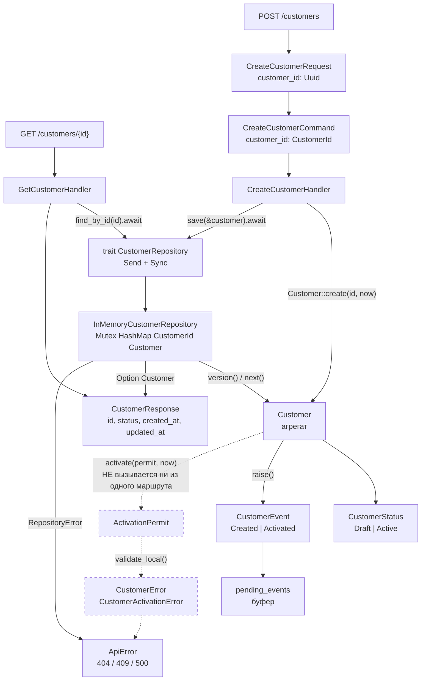
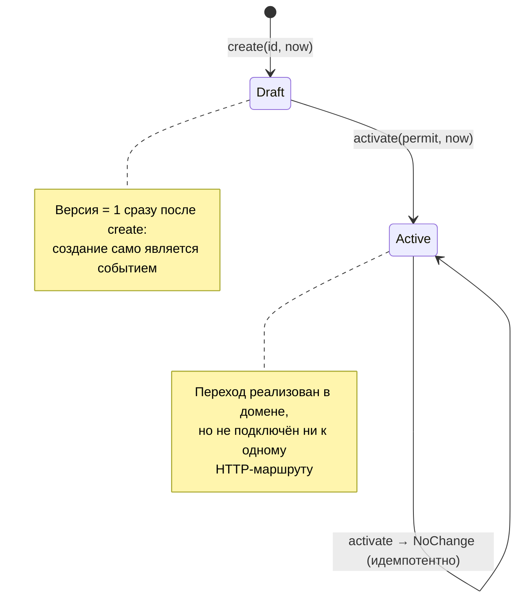

# 03. Модуль Customer

## Назначение

Показать вертикальный срез контекста «Клиент» — от HTTP-маршрута до агрегата
и обратно, с реальными именами методов.

## Что представлено

Два маршрута (`POST /customers`, `GET /customers/{id}`), два обработчика, один
порт, один адаптер, агрегат `Customer` с его состояниями, событиями и ошибками.

## Как читать

Подписи на стрелках — фактические имена вызываемых методов. Пунктирные узлы
и стрелки означают код, который существует, но ни из одного маршрута не
достижим.

## Поток вызовов

## Состояния агрегата

## Фактическое покрытие

| Элемент | Файл | Достижим по HTTP |
|---|---|---|
| `Customer::create` | `domain/customer/aggregate.rs` | да, `POST /customers` |
| `Customer::activate` | `domain/customer/aggregate.rs` | **нет** |
| `CustomerRepository::save` | `application/customer/ports.rs` | да |
| `CustomerRepository::find_by_id` | `application/customer/ports.rs` | да, `GET /customers/{id}` |
| `ActivationPermit` | `domain/customer/permit.rs` | **нет** |
| `CustomerEvent::Activated` | `domain/customer/event.rs` | **нет** |

## Что стоит знать

**Активация недостижима.** `Customer::activate` и весь механизм
`ActivationPermit` реализованы и покрыты юнит-тестами, но ни один обработчик
приложения их не вызывает. Клиент, созданный через API, навсегда остаётся в
статусе `Draft`. Обработчика `ActivateCustomerHandler` и маршрута
`POST /customers/{id}/activate` в коде нет.

**События никуда не уходят.** `raise()` складывает событие в `pending_events`,
но `pull_pending_events()` вызывается только из доменных тестов — ни репозиторий,
ни обработчик его не дренируют. Буфер событий заполняется и умирает вместе с
агрегатом. Подробнее в [13_gaps.md](13_gaps.md).

**Дубликат создания отклоняется через версию.** Отдельной проверки «уже
существует» нет: второй `create` приходит с версией 1, в хранилище уже лежит
версия 1, ожидается 2 — получается `VersionConflict` → HTTP 409.
