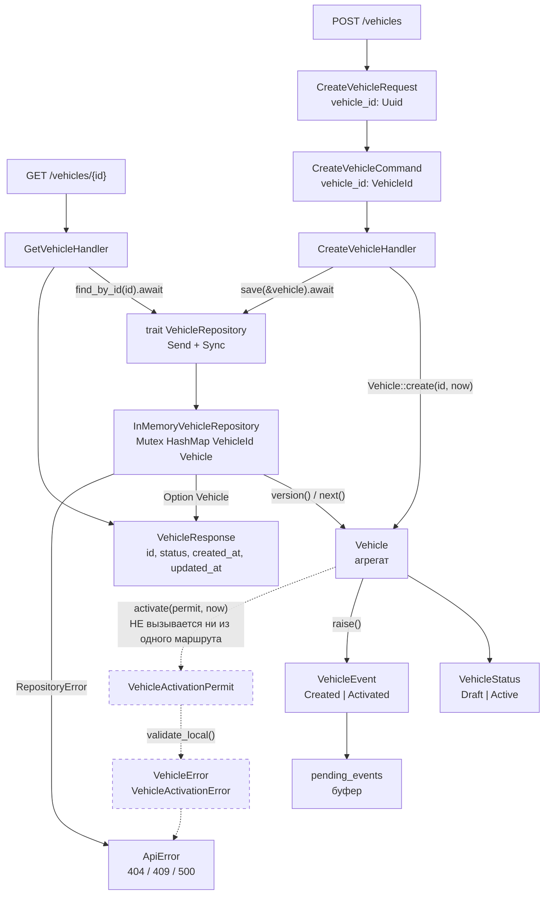
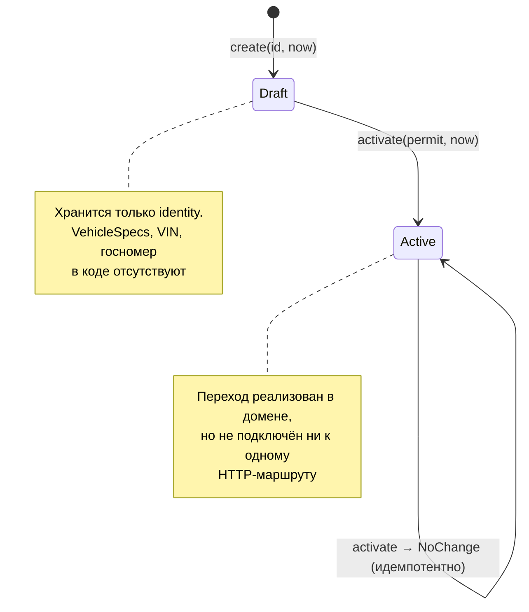

# 04. Модуль Vehicle

## Назначение

Показать вертикальный срез контекста «Автомобиль» — от HTTP-маршрута до
агрегата, с реальными именами методов.

## Что представлено

Два маршрута (`POST /vehicles`, `GET /vehicles/{id}`), два обработчика, один
порт, один адаптер, агрегат `Vehicle` с состояниями, событиями и ошибками.

## Как читать

Структура намеренно совпадает с [03_customer.md](03_customer.md) — контексты
устроены одинаково. Пунктир означает код, не достижимый ни из одного маршрута.

## Поток вызовов

## Состояния агрегата

## Фактическое покрытие

| Элемент | Файл | Достижим по HTTP |
|---|---|---|
| `Vehicle::create` | `domain/vehicle/aggregate.rs` | да, `POST /vehicles` |
| `Vehicle::activate` | `domain/vehicle/aggregate.rs` | **нет** |
| `VehicleRepository::save` | `application/vehicle/ports.rs` | да |
| `VehicleRepository::find_by_id` | `application/vehicle/ports.rs` | да, `GET /vehicles/{id}` |
| `VehicleActivationPermit` | `domain/vehicle/permit.rs` | **нет** |
| `VehicleEvent::Activated` | `domain/vehicle/event.rs` | **нет** |

## Отличие от модуля Customer

Единственное содержательное различие — в permit. `VehicleActivationPermit`
хранит `vehicle_id`, `issued_at`, `expires_at`, но **не хранит версию
агрегата**, тогда как `ActivationPermit` у клиента версию фиксирует и
сверяет.

Обоснование в коде: идентифицирующие сведения об автомобиле (VIN, госномер)
не меняются так, чтобы обесценить решение о пригодности, поэтому привязка к
версии давала бы только ложные отказы. У клиента иначе — там пригодность
зависит от подтверждённого контакта и согласия, которые могут быть отозваны.

## Чего в модуле нет

`VehicleSpecs`, VIN и госномер как объекты-значения в коде отсутствуют.
Агрегат `Vehicle` сейчас хранит только `id`, `status`, `created_at`,
`updated_at`, `version` и буфер событий. Тело автомобиля как предметной
сущности ещё не смоделировано.
