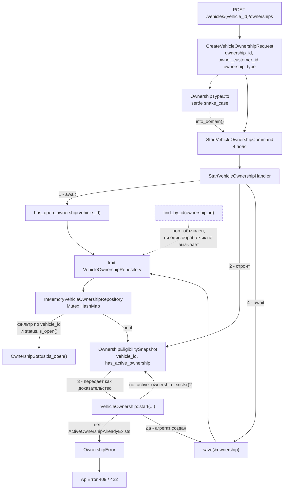
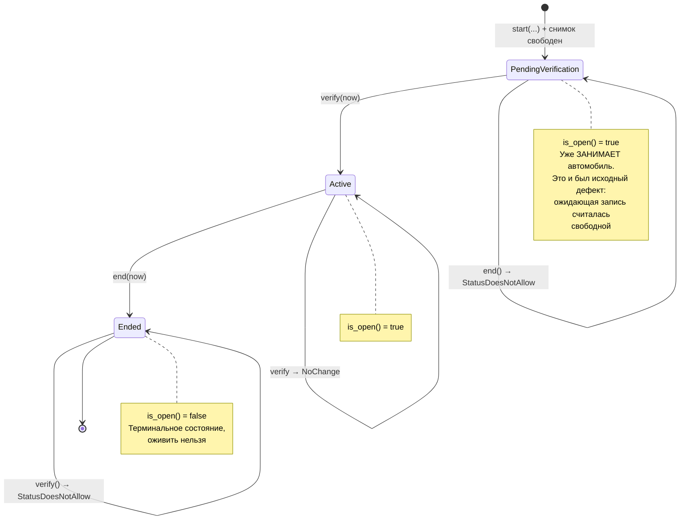
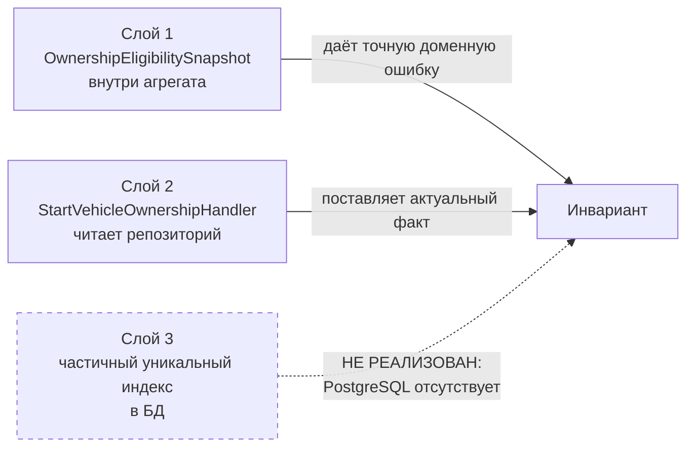

# 05. Модуль VehicleOwnership

## Назначение

Показать самый содержательный контекст проекта: единственный, где есть
кросс-агрегатный инвариант, машина состояний из трёх узлов и нетривиальная
координация между слоями.

## Что представлено

Маршрут `POST /vehicles/{vehicle_id}/ownerships`, обработчик, порт с тремя
методами, адаптер, агрегат и полная машина состояний.

## Как читать

Обратите внимание на **порядок** в обработчике: сначала чтение
(`has_open_ownership`), затем упаковка ответа в снимок, затем доменное решение,
и только потом запись. Именно этот порядок обеспечивает инвариант.

## Поток вызовов

## Машина состояний

## Как обеспечивается инвариант «одно открытое владение на автомобиль»

Правило охватывает несколько агрегатов, поэтому реализовано послойно:

**Существенное ограничение текущего состояния.** Слой 3 не существует, потому
что нет базы данных. Между чтением `has_open_ownership` и записью `save`
остаётся окно: два конкурентных запроса могут оба увидеть свободный автомобиль
и оба успешно записаться. In-memory-адаптер индексирует записи по
`VehicleOwnershipId`, поэтому выразить правило ограничением ключа он не может.

Иными словами: инвариант защищён от добросовестной ошибки, но **не защищён от
гонки**. Это осознанный компромисс периода разработки, а не упущение — но
знать о нём нужно.

## Фактическое покрытие

| Элемент | Достижим по HTTP |
|---|---|
| `VehicleOwnership::start` | да, `POST /vehicles/{id}/ownerships` |
| `VehicleOwnership::verify` | **нет** — вызывается только из тестов |
| `VehicleOwnership::end` | **нет** — вызывается только из тестов |
| `has_open_ownership` | да, косвенно через `start` |
| `save` | да |
| `find_by_id` | **нет** — обработчика чтения владения не существует |

Через API владение можно только **создать**. Подтвердить, завершить или
прочитать его нельзя: соответствующих обработчиков и маршрутов в коде нет.
