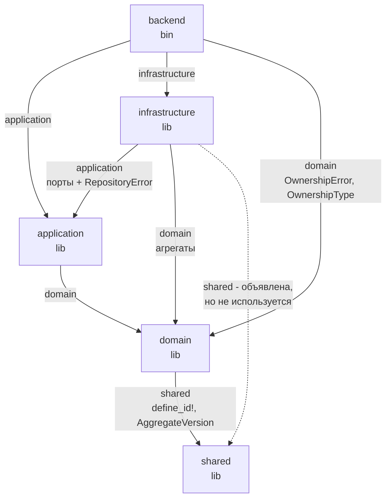
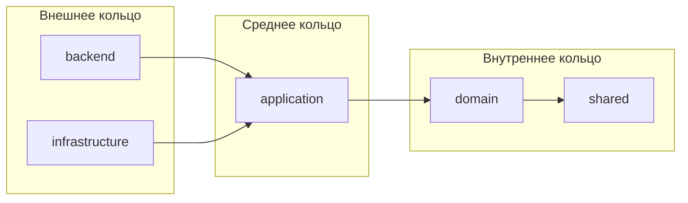

# 06. Граф зависимостей крейтов

## Назначение

Зафиксировать фактические зависимости между крейтами и показать, что правило
гексагональной архитектуры «зависимости направлены внутрь» действительно
соблюдается.

## Что представлено

Только зависимости, объявленные в `Cargo.toml` каждого крейта, с пометкой,
задействована ли зависимость в коде.

## Как читать

Стрелка `A --> B` означает «A зависит от B». Ключевая проверка: из `domain`
не выходит ни одной стрелки, кроме как в `shared`. Если появится стрелка от
`domain` наружу — архитектура нарушена.

## Зависимости между крейтами

## Полный список зависимостей

| Крейт | Внутренние | Внешние | Dev-зависимости |
|---|---|---|---|
| `backend` | application, infrastructure, domain | axum, tower-http, tokio, tracing, tracing-subscriber, serde, uuid, chrono | — |
| `infrastructure` | application, domain, ~~shared~~ | async-trait | chrono, tokio |
| `application` | domain | chrono, thiserror, async-trait | tokio |
| `domain` | shared | chrono, thiserror, uuid, ~~serde~~ | — |
| `shared` | — | chrono, serde, uuid | — |

Зачёркнутое — объявлено в `Cargo.toml`, но в коде крейта не встречается.

## Проверка правила гексагона

**Правило соблюдено.** Ни один крейт внутреннего кольца не зависит от
внешнего. Конкретно:

- `domain` не знает ни про SQL, ни про HTTP, ни про async-рантайм. В нём нет
  ни одной `async fn` — весь домен синхронный.
- `application` объявляет порты как трейты, но не знает ни одного адаптера.
- `infrastructure` зависит от `application`, а не наоборот — это и есть
  инверсия зависимостей.

Практическое следствие: 50 доменных тестов выполняются без Tokio и без
какого-либо хранилища.

## Замечания

**Две неиспользуемые зависимости.** `infrastructure → shared` и
`domain → serde` объявлены, но не задействованы. Они не ломают сборку, но
искажают граф: по `Cargo.toml` кажется, что `infrastructure` работает с
разделяемым ядром напрямую, тогда как типы вроде `AggregateVersion` приходят
транзитивно через `domain`.

**`backend → domain` — намеренная и корректная связь.** Транспортный слой
импортирует `OwnershipError` (для сопоставления с HTTP-кодами) и
`OwnershipType` (для конвертации DTO). Это не нарушение: `backend` находится
во внешнем кольце и вправе видеть внутренние типы. Стрелки в обратную сторону
нет.

**`sqlx` объявлена в `[workspace.dependencies]`, но не используется ни одним
крейтом.** На графе не отображена, поскольку ни один `Cargo.toml` её не
подключает.
