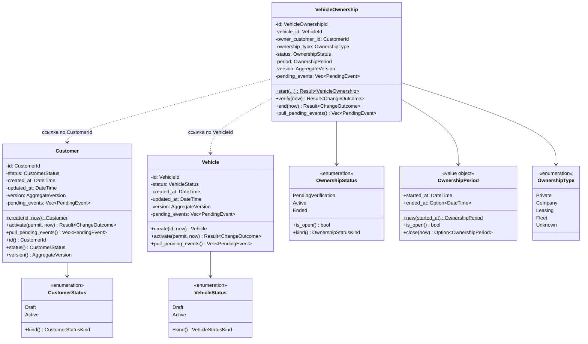
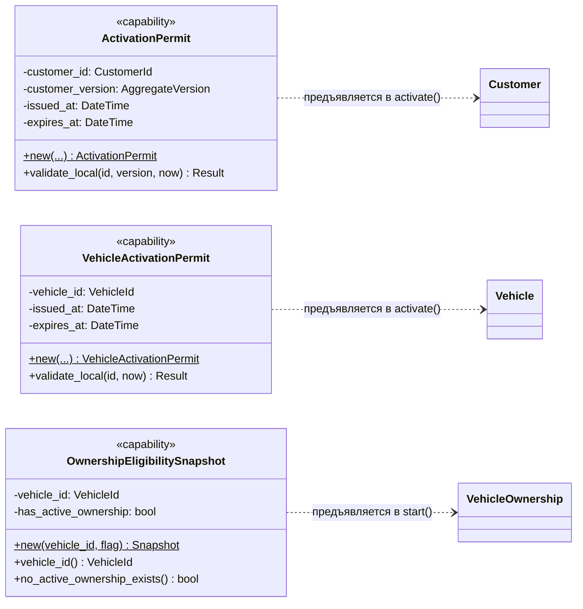
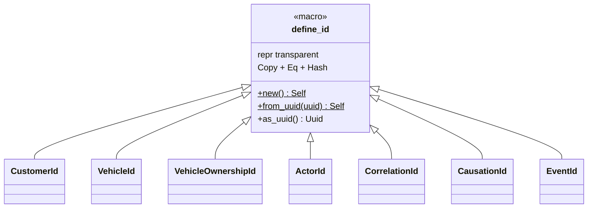
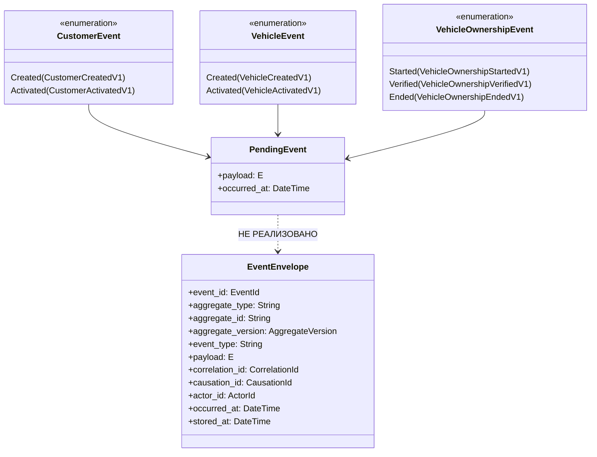
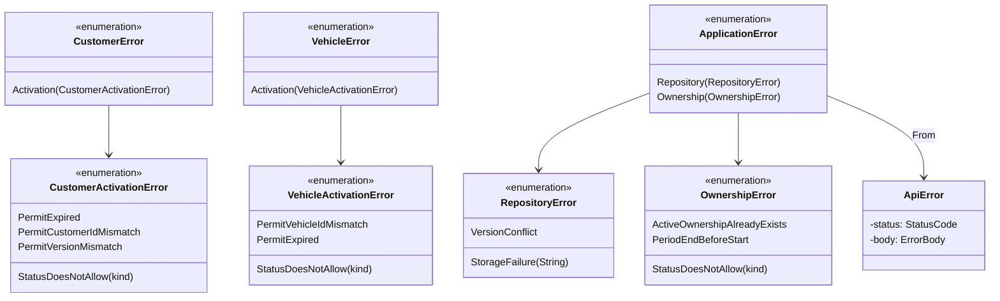

# 07. Доменная модель

## Назначение

Показать структуру доменных типов: поля агрегатов, объекты-значения,
идентификаторы, события, ошибки и связи между ними.

## Что представлено

Все публичные типы крейтов `domain` и `shared`. Приватные поля агрегатов
показаны — они существуют в коде, хотя снаружи недоступны.

## Как читать

- `-->` — композиция или владение полем
- `..>` — ссылка по идентификатору (объект не загружается)
- Приватные поля помечены `-`, публичные `+`

Обратите внимание: `VehicleOwnership` **ссылается** на `Customer` и `Vehicle`
по id, но не содержит их. Это граница агрегатов, а не техническая деталь.

## Агрегаты и их состав

## Capability-объекты и снимки

Отличие permit от снимка: permit фиксирует **разрешение**, выданное policy, а
снимок передаёт **факт**, прочитанный сервисом приложения. `ActivationPermit`
дополнительно привязан к версии агрегата, `VehicleActivationPermit` — нет
(обоснование см. в [04_vehicle.md](04_vehicle.md)).

## Идентификаторы

`CustomerId`, `VehicleId`, `VehicleOwnershipId` объявлены в `domain::ids`.
Остальные четыре — в `shared::ids`. Из них **в коде используется только
`CustomerId`, `VehicleId`, `VehicleOwnershipId`**: `ActorId`, `CorrelationId`,
`CausationId`, `EventId` нигде не конструируются.

## События

`EventEnvelope` определён в `shared::event`, но **нигде не конструируется**.
Преобразование `PendingEvent → EventEnvelope` в коде отсутствует, фабрики
конвертов нет. См. [13_gaps.md](13_gaps.md).

## Ошибки

**Асимметрия, заметная на диаграмме:** `ApplicationError` знает про
`OwnershipError`, но не про `CustomerError` и `VehicleError`. Это прямое
следствие того, что `activate()` нигде не вызывается — доменные ошибки
клиента и автомобиля физически не могут возникнуть в слое приложения, поэтому
для них нет и варианта преобразования.
