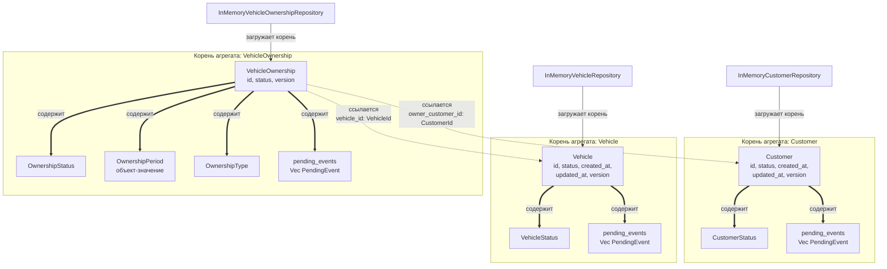
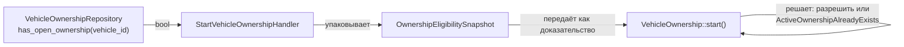
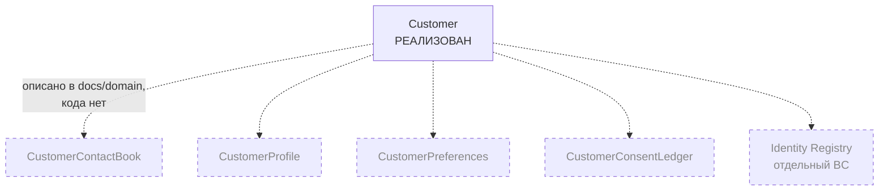

# 08. Границы агрегатов

## Назначение

Показать, где проходят транзакционные границы: что агрегат **содержит**, на
что он только **ссылается** и что загружает репозиторий.

## Что представлено

Три реализованных корня агрегатов и их состав. Агрегаты, описанные в
`docs/domain/`, но отсутствующие в коде, показаны отдельно и явно помечены.

## Как читать

Три типа связей, различать их принципиально:

| Обозначение | Значение | Транзакционное следствие |
|---|---|---|
| `==>` **содержит** | Часть агрегата, живёт и умирает вместе с ним | Меняется в одной транзакции с корнем |
| `-.->` **ссылается** | Хранится только идентификатор | Другая транзакция, объект не загружается |
| `-->` **загружает** | Репозиторий восстанавливает корень целиком | Одна операция чтения = один корень |

## Реализованные границы

## Почему границы проходят именно так

**`VehicleOwnership` хранит идентификаторы, а не объекты.** Владение можно
создать, подтвердить и завершить, ни разу не заблокировав клиента или
автомобиль. Если бы агрегат содержал `Customer` целиком, изменение статуса
владения конкурировало бы с изменением клиента — при том, что общих
инвариантов у них нет.

**Каждый репозиторий загружает ровно один корень.** Ни один порт не
возвращает граф объектов. `VehicleOwnershipRepository::find_by_id` отдаёт
`Option<VehicleOwnership>` — без клиента и без автомобиля.

**Автомобиль не содержит своих владений.** У `Vehicle` нет поля с коллекцией
`VehicleOwnership`. Владение живёт своим циклом и переживает смену
собственника; включение его в `Vehicle` сделало бы границу агрегата
неограниченно растущей.

## Кросс-агрегатный инвариант

Единственное правило, пересекающее границы: **на автомобиль не более одного
открытого владения**. Классический приём — вынести его в отдельный сервис или
расширить границу — здесь не применён. Вместо этого факт передаётся агрегату
как доказательство:

Граница агрегата при этом **не нарушается**: `VehicleOwnership::start` не
обращается к репозиторию и не читает другие агрегаты. Он лишь доверяет
переданному снимку. Ответственность за актуальность снимка лежит на сервисе
приложения.

## Спроектировано, но отсутствует в коде

В `docs/domain/` описаны дополнительные агрегаты контекста «Клиент». **Ни
одного из них в коде нет** — ни структуры, ни файла, ни ссылки:

Это существенно для чтения кода: `Customer` сейчас выглядит «пустым»
(только identity и статус) именно потому, что контакты, профиль, предпочтения
и согласия предполагалось вынести в соседние агрегаты, которые ещё не
написаны. Агрегат не бедный по ошибке — он бедный по замыслу, но замысел
реализован лишь наполовину.

Прямое следствие: `ActivationPermit` фиксирует версию клиента, чтобы
удостоверить проверки по `ContactBook` и `ConsentLedger`, — но проверять
пока нечего, поэтому и `activate()` никуда не подключён.
