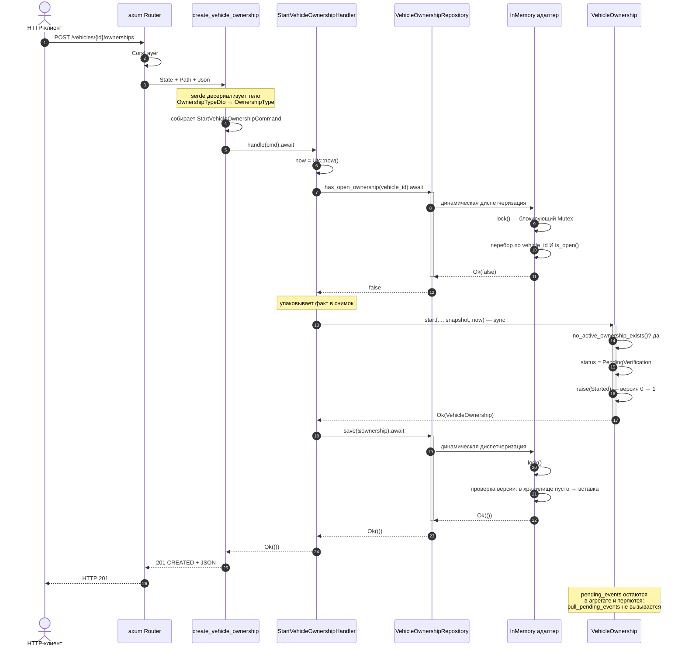
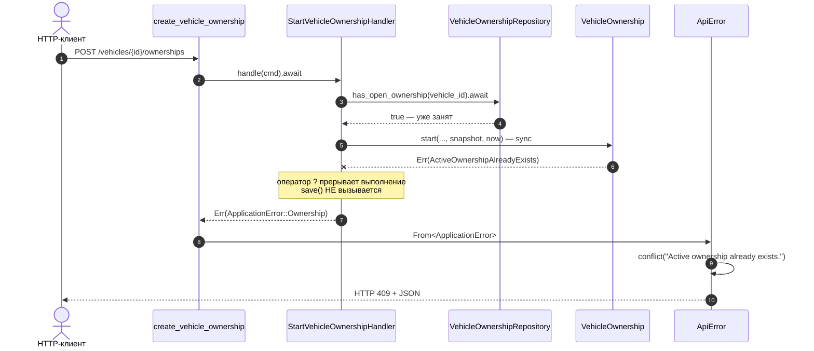
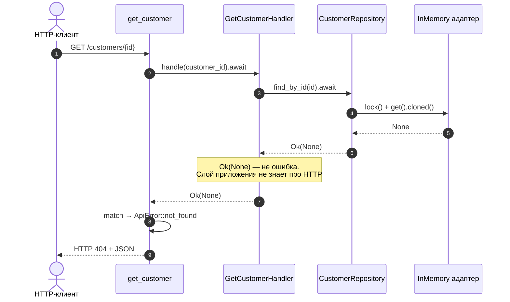

# 09. Жизненный цикл запроса

## Назначение

Показать во времени, что происходит при обработке HTTP-запроса: порядок
вызовов, точки `await`, места принятия решений и формирование ответа.

## Что представлено

Три сценария: успешное создание, доменный отказ и чтение с результатом
«не найдено».

## Как читать

Пометка `await` на стрелке означает точку, где задача может уступить рабочий
поток Tokio. `sync` означает синхронный вызов без приостановки — весь домен
синхронный.

## Сценарий 1: успешное создание владения

Самый содержательный путь — единственный, где обработчик выполняет и чтение,
и запись.

## Сценарий 2: доменный отказ — автомобиль занят

Существенная деталь: запись не происходит вовсе. Оператор `?` в обработчике
прерывает выполнение до `save`, поэтому отклонённая команда не оставляет
следов в хранилище.

## Сценарий 3: чтение, объект не найден

Обратите внимание, где принимается решение: `Ok(None)` доходит до маршрута
нетронутым, и только транспортный слой превращает отсутствие в `404`. Слой
приложения отсутствие ошибкой не считает.

## Сводка точек await

| Участок | Приостановка | Обоснование |
|---|---|---|
| axum → маршрут | да | Транспорт, чтение тела запроса |
| Маршрут → обработчик | да | `handle(cmd).await` |
| Обработчик → порт | да | Порт объявлен `async` |
| Порт → in-memory адаптер | **фактически нет** | `HashMap` отвечает сразу, future готов немедленно |
| Обработчик → агрегат | **нет** | Домен полностью синхронный |

В текущем виде ни один `await` не приводит к реальной приостановке: за портом
стоит `HashMap`, а не сеть. Асинхронность здесь — форма контракта под будущий
PostgreSQL, а не работающая конкурентность. Подробнее в
[12_async_architecture.md](12_async_architecture.md).
