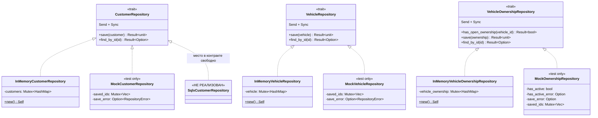
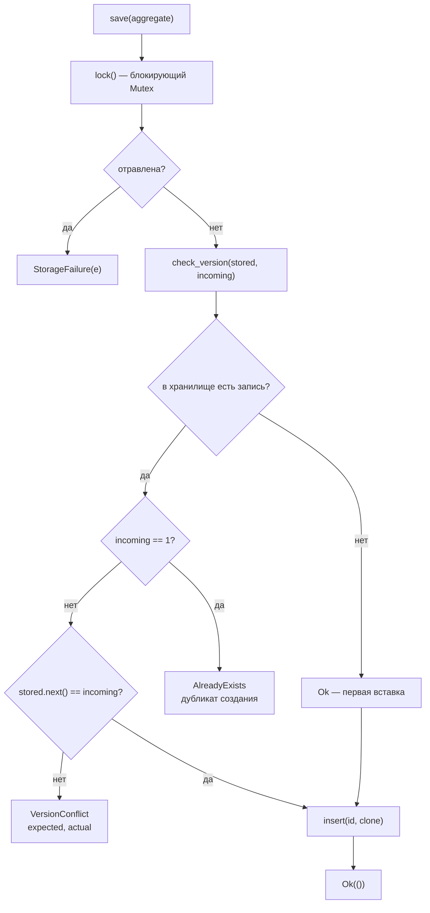
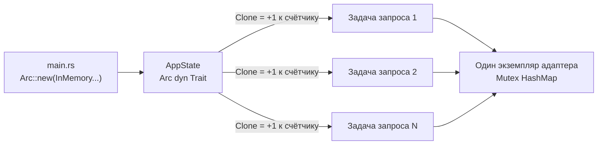

# 10. Архитектура репозиториев

## Назначение

Показать устройство слоя доступа к данным: порты, их реализации, контракт
оптимистичной блокировки и способ разделения адаптера между задачами.

## Что представлено

Три порта, три in-memory-адаптера, три мока из тестов. PostgreSQL-адаптер
**не реализован** и показан только как незанятое место в контракте.

## Как читать

`<|..` означает «реализует трейт». Пунктирная рамка — тип, которого в коде
нет.

## Порты и реализации

## О PostgreSQL

**Реализации нет.** В коде отсутствуют: адаптер на SQLx, миграции, пул
соединений, строка подключения, любые SQL-запросы.

Что действительно есть:

- `sqlx` объявлена в `[workspace.dependencies]` корневого `Cargo.toml`
  с фичами `postgres`, `migrate`, `runtime-tokio`, `tls-rustls`, `uuid`, `chrono`
- ни один крейт эту зависимость не подключает
- порты объявлены `async` и возвращают `RepositoryError`, то есть контракт под
  сетевое хранилище уже готов
- в доках агрегата `VehicleOwnership` упоминается частичный уникальный индекс
  как окончательный гарант инварианта

Иначе говоря: **интерфейс готов принять SQLx-адаптер, но самого адаптера не
существует**. Узел `SqlxCustomerRepository` на диаграмме отмечает свободное
место в контракте, а не запланированный код.

## Контракт оптимистичной блокировки

Все три in-memory-адаптера реализуют его одинаково:

Логика вынесена в общий `pub(crate) fn check_version` в
`infrastructure/lib.rs`, чтобы правило было записано один раз, а не
продублировано в трёх адаптерах:

**Дубликат создания и устаревшая запись теперь различаются.** До PR #9 обе
ситуации давали `VersionConflict`. Сейчас `check_version` разделяет их по
входящей версии: агрегат, только что созданный, всегда приходит с версией 1,
поэтому «версия 1 при непустом хранилище» — это повторное создание
(`AlreadyExists`), а любое другое расхождение — устаревшее обновление
(`VersionConflict`).

Различие не косметическое: клиенту стоит повторить устаревшую запись после
перечитывания, но повтор занятого идентификатора не удастся никогда. На уровне
HTTP это два разных кода при одном статусе 409 — см.
[03_customer.md](03_customer.md) и таблицу кодов в `backend/src/error.rs`.

**Допущение, на котором держится различение.** «Версия 1 = только что создан»
верно лишь потому, что каждый `create` порождает ровно одно событие. Адаптер
или агрегат, чей `create` поднимет два события, сломает эту классификацию:
подлинное устаревшее обновление, случайно пришедшее с версией 1, будет принято
за дубликат. Допущение зафиксировано в doc-комментарии `check_version`.

## Разделение адаптера между задачами

axum клонирует `AppState` на каждый запрос. `Arc` делает это увеличением
счётчика ссылок, а не копированием хранилища, — иначе каждый запрос получал бы
собственную пустую `HashMap`, и данные не сохранялись бы между вызовами.

## Выбор примитива синхронизации

Используется `std::sync::Mutex`, а не `tokio::sync::Mutex`. Это корректно
**ровно потому**, что охранник блокировки нигде не удерживается через `.await`:
каждый метод захватывает блокировку, выполняет синхронную работу и освобождает
её до возврата.

Добавление `.await` внутрь заблокированного участка сделало бы это рассуждение
неверным и создало бы риск остановки рабочего потока Tokio. Это единственное
изменение, которое ломает текущую корректность, — и оно неочевидно при беглом
чтении, поэтому вынесено сюда.

## Известное ограничение

`InMemoryVehicleOwnershipRepository` индексирует записи по
`VehicleOwnershipId`, поэтому правило «одно открытое владение на автомобиль»
нельзя выразить ограничением ключа. Оно проверяется методом
`has_open_ownership` **перед** записью, что оставляет окно между чтением и
записью. Под настоящей конкурентностью два запроса могут оба увидеть свободный
автомобиль и оба записаться.

Закрыть это окно должен частичный уникальный индекс в БД, которой нет.
