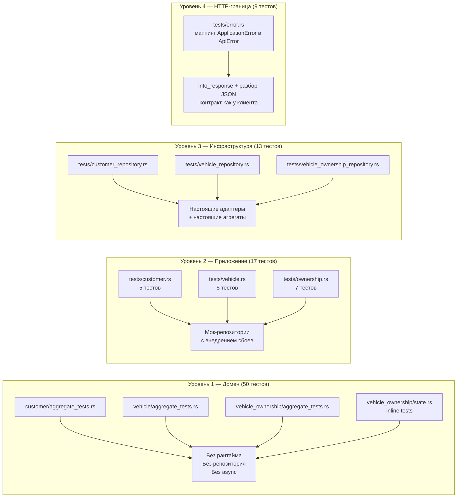
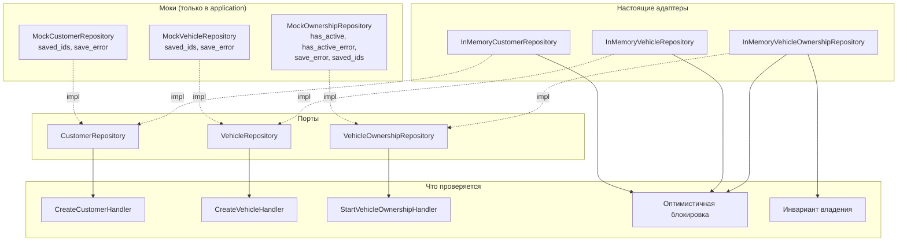
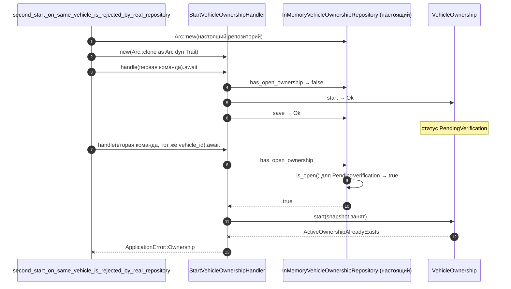

# 11. Тестовая архитектура

## Назначение

Показать, как устроено тестирование: где юнит-тесты, где интеграционные, где
моки и где настоящие адаптеры — и что именно проверяет каждый уровень.

## Что представлено

Все 89 тестов, распределённые по четырём уровням, с указанием тестового
двойника.

## Как читать

Слева направо — от самого изолированного уровня к самому связному. Чем правее,
тем больше настоящих компонентов участвует.

## Три уровня тестирования

## Кто с чем работает

## Что проверяет каждый уровень

**Уровень 1 — домен.** Инварианты агрегатов в изоляции: одна команда = одно
событие = +1 к версии; идемпотентность (`NoChange` вместо ошибки при повторе);
запрещённые машиной состояний переходы; проверки permit. Выполняются без Tokio
и без хранилища — практическая выгода от того, что домен свободен от
ввода-вывода.

**Уровень 2 — приложение.** Оркестрация с подставными репозиториями. Моки
позволяют то, чего не даёт настоящее хранилище: **внедрение сбоев**. Тесты
`handle_propagates_storage_failure` и `handle_propagates_version_conflict`
проверяют, что обработчик пробрасывает ошибку репозитория, а не поглощает её;
`handle_does_not_save_on_repository_error` — что при доменном отказе запись не
выполняется вовсе.

**Уровень 3 — инфраструктура.** Настоящий адаптер и настоящие агрегаты вместе.
Проверяет то, чего не может подтвердить ни один из предыдущих уровней:
совпадает ли арифметика версий в адаптере с версиями, которые действительно
порождают агрегаты.

## Ключевой интеграционный тест

Это регрессионный тест исходного дефекта задачи 001. **Мок его поймать бы не
смог**: ошибка была в том, как настоящий репозиторий классифицировал
ожидающую запись, а мок возвращал бы заранее заданный `has_active`. Поэтому
тест намеренно использует подлинный адаптер, а не двойник.

## Структура тестовых модулей

| Крейт | Расположение | Подключение |
|---|---|---|
| `domain` | рядом с агрегатом, `#[path]` + `#[cfg(test)]` | `mod aggregate_tests` |
| `application` | `src/tests/`, `#[cfg(test)] mod tests` в `lib.rs` | корректно закрыт гейтом |
| `backend` | `src/tests/`, `#[cfg(test)] mod tests` в `main.rs` | корректно закрыт гейтом |
| `infrastructure` | `src/tests/`, `pub mod tests` в `lib.rs` | **гейта нет** |

Расхождение в последней строке: `infrastructure` объявляет `pub mod tests;`
без `#[cfg(test)]`. Тестовый код в релизные сборки не попадает — внутренние
модули закрыты гейтом, — но пустой публичный модуль `tests` экспортируется из
крейта в любой сборке. `application` и `backend` делают это правильно.

**Побочный эффект выноса тестов из модуля.** Тесты `backend` живут в
`src/tests/error.rs`, а не внутри `error.rs`, и потому физически не могут
дотянуться до приватных полей `ApiError`. Статус читается из готового
`Response`, а не из поля структуры, — то есть проверяется в точности то, что
увидит клиент. Ограничение видимости здесь работает как проектное средство, а
не как помеха.

## Чего в тестах нет

**Сквозных HTTP-тестов нет.** Контракт ошибок покрыт (9 тестов уровня 4), но
ни один тест не поднимает axum-роутер и не проверяет маршрут целиком. Непокрыты
остаются: `main.rs` со сборкой роутера и CORS, десериализация тел запросов,
конвертация `OwnershipTypeDto → OwnershipType`, коды успешных ответов и сами
`routers/*`. Всё это проверено только компилятором.

Заполнить этот пробел — предмет задачи 005 из `docs/ai/18.07.2026/TASKS/`.
Тесты уровня 4 намеренно сделаны через `into_response()` с разбором JSON, чтобы
подготовить приём, который там понадобится.

**Тестов на конкурентность нет.** Окно между чтением и записью в
`StartVehicleOwnershipHandler` никак не проверяется. Тест, запускающий два
одновременных `start` на один автомобиль, скорее всего показал бы, что оба
проходят, — но такого теста нет.
