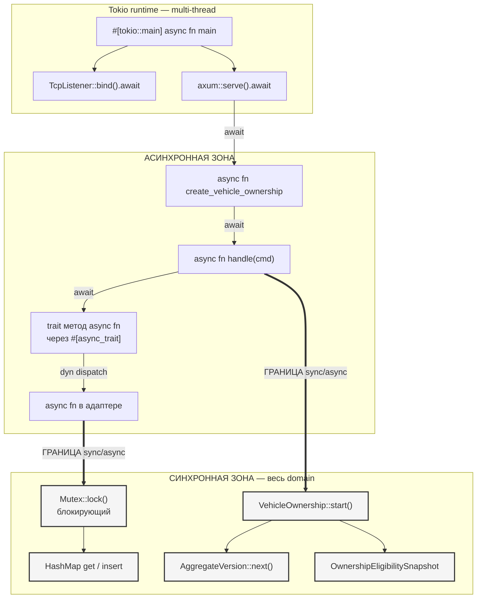
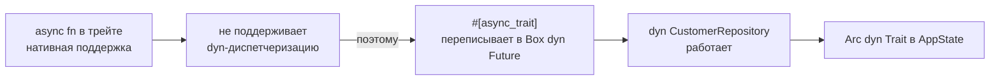
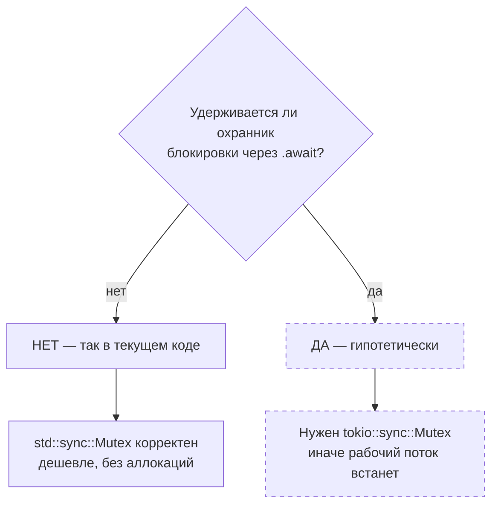
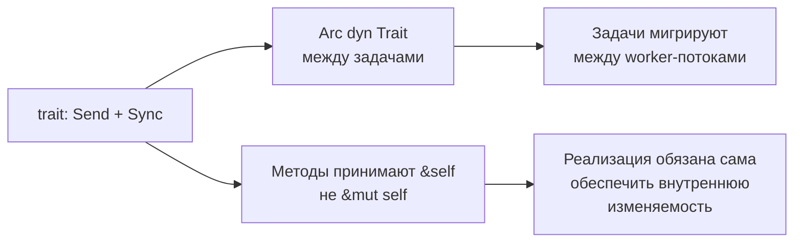
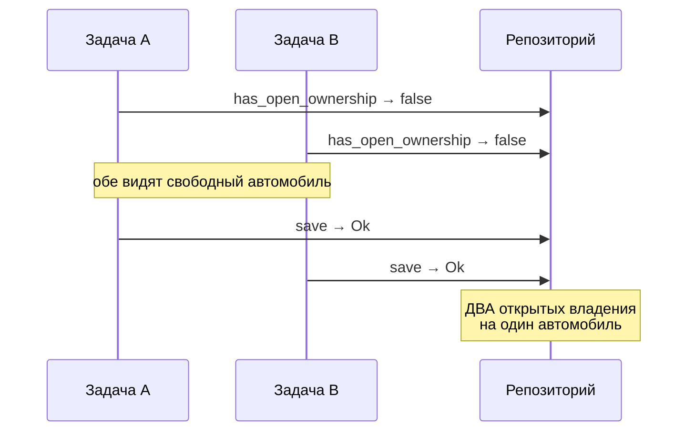

# 12. Асинхронная архитектура

## Назначение

Показать, где в системе проходит граница между асинхронным и синхронным кодом,
где стоят точки `.await` и почему выбран именно блокирующий мьютекс.

## Что представлено

Полный асинхронный путь от Tokio-рантайма до агрегата, с явной отметкой
границы sync/async.

## Как читать

Красная граница на диаграмме — место, где асинхронный мир заканчивается.
Ниже неё нет ни одной `async fn`: весь домен синхронный, и это осознанное
решение.

## Граница async и sync

## Все точки await в кодовой базе

| Файл | Вызов | Реально приостанавливается |
|---|---|---|
| `main.rs` | `TcpListener::bind(addr).await` | да — сетевая операция |
| `main.rs` | `axum::serve(listener, app).await` | да — бесконечно |
| `routers/customer.rs` | `handler.handle(cmd).await` | нет |
| `routers/vehicle.rs` | `handler.handle(cmd).await` | нет |
| `routers/vehicle_ownership.rs` | `handler.handle(cmd).await` | нет |
| `customer/handlers.rs` | `self.repository.save(...).await` | нет |
| `customer/handlers.rs` | `self.repository.find_by_id(...).await` | нет |
| `vehicle/handlers.rs` | `save` / `find_by_id` `.await` | нет |
| `ownership/handlers.rs` | `has_open_ownership(...).await` | нет |
| `ownership/handlers.rs` | `save(...).await` | нет |

**Важное следствие.** Кроме двух вызовов в `main.rs`, ни один `await` в системе
не приводит к настоящей приостановке. За портом стоит `HashMap`, future
готов немедленно, задача продолжает выполняться на том же рабочем потоке.

Асинхронность здесь — **форма контракта**, рассчитанная на будущий PostgreSQL,
а не работающая конкурентность. Это не недостаток: порт должен иметь форму,
задаваемую требовательной реализацией, а не удобной. Но при чтении профиля
производительности об этом стоит помнить.

## Почему `#[async_trait]`

Порты должны быть object-safe, потому что `AppState` хранит их как
`Arc<dyn Trait>` — иначе обработчики пришлось бы параметризовать типом
адаптера, и `backend` снова узнал бы про конкретную реализацию.

## Почему `std::sync::Mutex`, а не `tokio::sync::Mutex`

Каждый метод адаптера захватывает блокировку, выполняет **исключительно
синхронную** работу (`get`, `insert`, `values().any()`) и освобождает её до
возврата. Обычная угроза — заблокировать рабочий поток Tokio на время
ожидания — здесь возникнуть не может.

**Это условие, а не свойство.** Добавление `.await` внутрь заблокированного
участка немедленно делает выбор неверным. Единственное изменение, ломающее
текущую корректность, — и его легко внести случайно при переходе на SQLx, где
запрос естественно захочется выполнить под блокировкой.

## Требования к потокобезопасности портов

`&self` вместо `&mut self` — не стилистика: несколько задач держат один и тот
же `Arc` одновременно, эксклюзивную ссылку получить невозможно. Отсюда
`Mutex` внутри каждого адаптера.

## Где конкурентность реально проявится

Сейчас — практически нигде, поскольку всё в памяти. Но окно между чтением и
записью в `StartVehicleOwnershipHandler` существует уже сегодня:

Между `has_open_ownership` и `save` блокировка **не удерживается** — она
берётся и отпускается внутри каждого метода отдельно. Инвариант защищён от
добросовестной ошибки, но не от гонки. Закрыть окно должен частичный
уникальный индекс в БД, которой нет.
