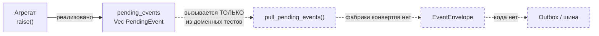
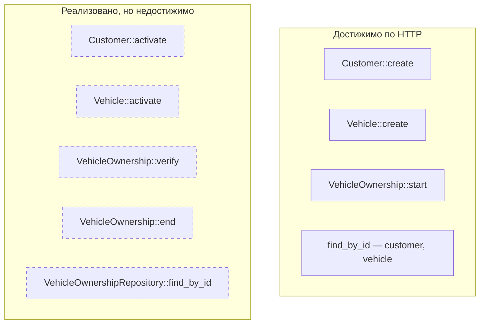
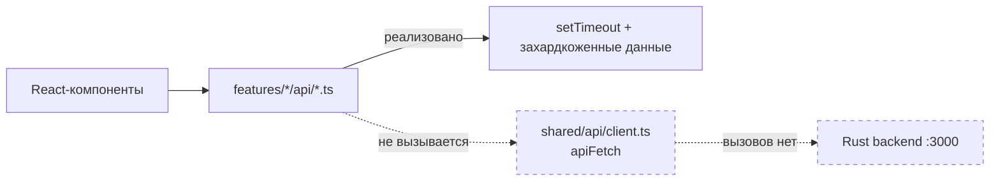
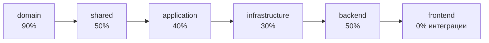

# 13. Спроектировано, но не реализовано

## Назначение

Свести в одно место расхождения между задуманной архитектурой и фактическим
кодом. Без этого файла остальные диаграммы могут создать впечатление большей
завершённости, чем есть на самом деле.

## Что представлено

Только проверенные факты: для каждого пункта указано, чем именно подтверждено
отсутствие связи.

## Как читать

Пунктир — заготовленный, но не задействованный код. Это не список ошибок:
многое здесь — осознанные заготовки. Но каждая заготовка выглядит в коде как
рабочий механизм, и отличить одно от другого при чтении трудно.

## 1. События порождаются, но никуда не уходят

**Чем подтверждено.** `grep pull_pending_events` даёт совпадения только в
`domain/*/aggregate.rs` (определения) и `domain/*/aggregate_tests.rs`
(вызовы). Ни один репозиторий, обработчик или маршрут его не вызывает.

**Следствие.** Каждый успешный запрос порождает событие, кладёт его в буфер
агрегата, сохраняет агрегат клоном — и теряет буфер вместе с локальной
переменной. Событийная часть системы написана, но не подключена.

## 2. `EventEnvelope` и аудит-контекст не конструируются

| Тип | Файл | Где используется |
|---|---|---|
| `EventEnvelope` | `shared/event.rs` | нигде |
| `ActionContext` | `shared/audit.rs` | нигде |
| `RoleSnapshot` | `shared/audit.rs` | только внутри `ActionContext` |
| `ActorId` | `shared/ids.rs` | только в полях этих типов |
| `CorrelationId` | `shared/ids.rs` | только в полях этих типов |
| `CausationId` | `shared/ids.rs` | только в полях этих типов |
| `EventId` | `shared/ids.rs` | только в полях этих типов |

Весь механизм корреляции и аудита определён, но ни одно значение этих типов
нигде не создаётся. `AggregateVersion`, `ChangeOutcome` и `PendingEvent` из
того же крейта, напротив, задействованы полноценно.

## 3. Команды, недостижимые по HTTP

Для каждого из пяти пунктов справа отсутствует обработчик приложения, команда
и маршрут. Проверено grep'ом: `activate(` не встречается вне `crates/domain`,
`.verify(`/`.end(` — только в тестах инфраструктуры.

**Практическое следствие.** Через API сущность можно только создать. Клиент и
автомобиль навсегда остаются в `Draft`, владение — в `PendingVerification`.
Половина машины состояний каждого агрегата недоступна.

## 4. Агрегаты контекста «Клиент» отсутствуют

Описаны в `docs/domain/`, в коде нет ни одного файла:

- `CustomerContactBook`
- `CustomerProfile`
- `CustomerPreferences`
- `CustomerConsentLedger`
- Identity Registry (отдельный ограниченный контекст)

Это объясняет, почему `Customer` выглядит почти пустым и почему `activate()`
никуда не подключён: permit создан удостоверять проверки по `ContactBook` и
`ConsentLedger`, а проверять пока нечего.

## 5. Персистентность

| Компонент | Состояние |
|---|---|
| Порты репозиториев | реализованы, `async`, готовы к сетевому хранилищу |
| In-memory адаптеры | реализованы, с оптимистичной блокировкой |
| SQLx-адаптеры | **отсутствуют** |
| Миграции | **отсутствуют** |
| Пул соединений | **отсутствует** |
| Частичный уникальный индекс | **отсутствует** — третий слой инварианта владения |
| `sqlx` в workspace deps | объявлена, не подключена ни одним крейтом |

## 6. Транзакционность

`UnitOfWork` упоминается в доках агрегатов как механизм, повторно
утверждающий инварианты при commit. **В коде его нет.** Каждый вызов `save`
независим; способа атомарно сохранить несколько агрегатов не существует.

Для текущего набора сценариев это не проблема — каждый обработчик пишет ровно
один агрегат. Проблемой станет при появлении сценария, затрагивающего два.

## 7. Фронтенд не подключён к бэкенду

**Чем подтверждено.** `apiFetch` определён в `shared/api/client.ts` и
упоминается ровно один раз — в комментарии внутри `customerApi.ts`. Ни одного
вызова нет. `customerApi.ts` и `vehicleApi.ts` возвращают захардкоженные
данные после `delay()`.

CORS в `main.rs` настроен на `http://localhost:5173`, то есть связь
подготовлена с обеих сторон, но не установлена.

Дополнительно: модели фронтенда и бэкенда **расходятся**. Фронтовый `Customer`
имеет `fullName`, `phone`, `email`, `status: "onboarding"`; доменный
`Customer` — только `id`, `status: Draft | Active`, метки времени. Фронтовый
`Vehicle` содержит `make`, `model`, `year`, `plateNumber`, `vin`, `mileage`,
которых в домене нет вовсе.

## 8. Мелкие расхождения в сборке

| Что | Где | Замечание |
|---|---|---|
| `shared` в зависимостях | `infrastructure/Cargo.toml` | объявлена, `shared::` в коде не встречается |
| `serde` в зависимостях | `domain/Cargo.toml` | объявлена, в коде не встречается |
| `sqlx` | корневой `Cargo.toml` | не подключена ни одним крейтом |
| `pub mod tests` | `infrastructure/lib.rs` | без `#[cfg(test)]`, в отличие от `application` |
| edition | 3 крейта | `2024` жёстко вместо `workspace = true` (у `domain`/`shared` — `2021`) |

## Сводка зрелости по слоям

Оценки приблизительные, по доле реализованного от описанного в `docs/domain/`:

- **domain** — самый зрелый слой: агрегаты, инварианты, машины состояний,
  50 тестов. Не хватает соседних агрегатов клиента и объектов-значений автомобиля.
- **shared** — половина типов не задействована (весь событийно-аудитный блок).
- **application** — только команды создания; активации, подтверждения,
  завершения и `UnitOfWork` нет.
- **infrastructure** — только in-memory; настоящей персистентности нет.
- **backend** — маршруты создания и чтения есть, тестов нет вовсе.
- **frontend** — существует и работает, но с бэкендом не связан.
