# Customer domain model

Ниже описана предлагаемая граница агрегата `Customer`. Диаграмма отражает
владение данными в Rust, а не наследование между классами.

```mermaid
classDiagram
    direction LR

    %% Aggregate Root
    class Customer {
        <<AggregateRoot>>
        <<Entity>>
        -CustomerId id
        -CustomerIdentity identity
        -CustomerProfile profile
        -CustomerStatus status
        -CustomerConsents consents
        -DateTime~Utc~ created_at
        -Option~DateTime_Utc~ updated_at
        -Vec~CustomerDomainEvent~ domain_events
        +create(...) Result~Customer, CustomerError~
        +update_full_name(...) Result~void, CustomerError~
        +change_display_name(...) Result~void, CustomerError~
        +change_avatar(...) Result~void, CustomerError~
        +change_city(...) Result~void, CustomerError~
        +change_language(...) Result~void, CustomerError~
        +change_timezone(...) Result~void, CustomerError~
        +add_phone(...) Result~void, CustomerError~
        +change_phone(...) Result~void, CustomerError~
        +verify_phone(...) Result~void, CustomerError~
        +add_email(...) Result~void, CustomerError~
        +change_email(...) Result~void, CustomerError~
        +verify_email(...) Result~void, CustomerError~
        +link_telegram(...) Result~void, CustomerError~
        +unlink_telegram(...) Result~void, CustomerError~
        +change_primary_contact_method(...) Result~void, CustomerError~
        +accept_terms(...) Result~void, CustomerError~
        +accept_privacy_policy(...) Result~void, CustomerError~
        +accept_data_processing(...) Result~void, CustomerError~
        +grant_marketing_consent(...) Result~void, CustomerError~
        +revoke_marketing_consent(...) Result~void, CustomerError~
        +change_status(...) Result~void, CustomerError~
        +pull_domain_events() Vec~CustomerDomainEvent~
    }

    %% Value Objects
    class CustomerId {
        <<ValueObject>>
        <<TypeSafeNewtype>>
        -Uuid value
        +new() CustomerId
        +from_uuid(Uuid) CustomerId
        +as_uuid() Uuid
    }

    class CustomerProfile {
        <<ValueObject>>
        -Option~FullName~ full_name
        -DisplayName display_name
        -Option~Avatar~ avatar
        -Option~City~ city
        -LanguageCode language
        -IanaTimezone timezone
    }

    class FullName {
        <<ValueObject>>
        -String first_name
        -String last_name
        -Option~String~ middle_name
    }
    class DisplayName {
        <<ValueObject>>
        -String value
    }
    class Avatar {
        <<ValueObject>>
        -AssetId asset_id
        -Url url
    }
    class City {
        <<ValueObject>>
        -String value
    }
    class LanguageCode {
        <<ValueObject>>
        -String value
    }
    class IanaTimezone {
        <<ValueObject>>
        -String value
    }

    class CustomerIdentity {
        <<ValueObject>>
        -Option~PhoneIdentity~ phone
        -Option~EmailIdentity~ email
        -Option~TelegramIdentity~ telegram
        -PrimaryContactMethod primary_contact
    }

    class PhoneIdentity {
        <<ValueObject>>
        -PhoneNumber number
        -Option~DateTime_Utc~ verified_at
        -DateTime~Utc~ changed_at
    }
    class EmailIdentity {
        <<ValueObject>>
        -EmailAddress address
        -Option~DateTime_Utc~ verified_at
        -DateTime~Utc~ changed_at
    }
    class TelegramIdentity {
        <<ValueObject>>
        -TelegramUserId user_id
        -Option~String~ username
        -DateTime~Utc~ linked_at
        -Option~DateTime_Utc~ last_seen_at
    }
    class PrimaryContactMethod {
        <<Enum>>
        Phone
        Email
        Telegram
    }

    class CustomerConsents {
        <<ValueObject>>
        -Option~TermsConsent~ terms
        -Option~PrivacyPolicyConsent~ privacy_policy
        -Option~DataProcessingConsent~ data_processing
        -MarketingConsent marketing
    }
    class TermsConsent {
        <<ValueObject>>
        -ConsentVersion version
        -DateTime~Utc~ accepted_at
    }
    class PrivacyPolicyConsent {
        <<ValueObject>>
        -ConsentVersion version
        -DateTime~Utc~ accepted_at
    }
    class DataProcessingConsent {
        <<ValueObject>>
        -ConsentVersion version
        -DateTime~Utc~ accepted_at
    }
    class MarketingConsent {
        <<ValueObject>>
        -Option~DateTime_Utc~ granted_at
        -Option~DateTime_Utc~ revoked_at
        -Option~ConsentSource~ source
    }

    class CustomerStatus {
        <<Enum>>
        PendingVerification
        Active
        Suspended
        Blocked
        Deleted
    }

    Customer *-- "1" CustomerId : owns
    Customer *-- "1" CustomerIdentity : owns
    Customer *-- "1" CustomerProfile : owns
    Customer *-- "1" CustomerStatus : owns
    Customer *-- "1" CustomerConsents : owns

    CustomerProfile *-- "0..1" FullName
    CustomerProfile *-- "1" DisplayName
    CustomerProfile *-- "0..1" Avatar
    CustomerProfile *-- "0..1" City
    CustomerProfile *-- "1" LanguageCode
    CustomerProfile *-- "1" IanaTimezone

    CustomerIdentity *-- "0..1" PhoneIdentity
    CustomerIdentity *-- "0..1" EmailIdentity
    CustomerIdentity *-- "0..1" TelegramIdentity
    CustomerIdentity *-- "1" PrimaryContactMethod

    CustomerConsents *-- "0..1" TermsConsent
    CustomerConsents *-- "0..1" PrivacyPolicyConsent
    CustomerConsents *-- "0..1" DataProcessingConsent
    CustomerConsents *-- "1" MarketingConsent

    %% Domain Events
    class CustomerDomainEvent {
        <<DomainEventEnum>>
        CustomerCreated
        CustomerPhoneAdded
        CustomerPhoneChanged
        CustomerPhoneVerified
        CustomerEmailAdded
        CustomerEmailChanged
        CustomerEmailVerified
        CustomerTelegramLinked
        CustomerTelegramUnlinked
        CustomerPrimaryContactMethodChanged
        CustomerTermsAccepted
        CustomerPrivacyPolicyAccepted
        CustomerDataProcessingAccepted
        CustomerMarketingConsentGranted
        CustomerMarketingConsentRevoked
        CustomerProfileChanged
        CustomerStatusChanged
    }
    Customer ..> CustomerDomainEvent : records

    %% Invariants
    class CustomerInvariants {
        <<BusinessRules>>
        identity_has_at_least_one_contact
        primary_contact_exists_in_identity
        primary_contact_is_verified_when_required
        active_customer_has_at_least_one_verified_identity
        active_customer_has_required_consents
        contacts_are_normalized_and_valid
        changed_contact_becomes_unverified
        consent_versions_and_timestamps_are_recorded
        marketing_revocation_is_not_before_grant
        deleted_customer_cannot_be_modified
        status_transition_must_be_allowed
        every_state_change_updates_updated_at
        meaningful_changes_record_domain_events
    }
    Customer ..> CustomerInvariants : enforces

    class CustomerStatusTransitions {
        <<BusinessRules>>
        PendingVerification_to_Active_or_Deleted
        Active_to_Suspended_or_Blocked_or_Deleted
        Suspended_to_Active_or_Blocked_or_Deleted
        Blocked_to_Active_or_Deleted
        Deleted_is_terminal
    }
    CustomerStatus ..> CustomerStatusTransitions : constrained by
```



## Aggregate boundary

`Customer` является Aggregate Root, потому что он задает единственную точку
изменения идентичности, профиля, согласий и статуса клиента. Только агрегат
проверяет правила, согласованно обновляет `updated_at` и записывает доменные
события.

`CustomerProfile`, `CustomerIdentity`, `CustomerConsents` и вложенные в них
Value Object не имеют самостоятельного жизненного цикла и не должны храниться
или изменяться как отдельные агрегаты. В репозитории сохраняется и загружается
целый `Customer`; инфраструктурное разбиение по таблицам этого правила не
меняет.

Добавление и подтверждение контактов, выбор основного канала, принятие и отзыв
согласий, изменение профиля и переходы статуса должны выполняться только через
методы `Customer`. Публичные изменяемые поля и универсальные `set_*`-методы
обходили бы инварианты и не должны быть частью доменного API.

`Deleted` является терминальным состоянием. Для перехода в `Active` нужны все
обязательные согласия и хотя бы один подтвержденный identity. Клиенты в
`Suspended` и `Blocked` не могут создавать booking, оставлять отзывы и создавать
новые обращения в СТО, но могут просматривать историю и обращаться в поддержку.

В исходной Excalidraw-схеме встречаются альтернативные имена и гранулярность
событий: `CustomerRegistered` вместо `CustomerCreated`, конкретные события
жизненного цикла вместо `CustomerStatusChanged`, а также профильные события
разного уровня детализации. Диаграмма использует перечень из требований к этому
документу. Перед реализацией следует выбрать один контракт и не публиковать
одновременно несколько событий об одном и том же факте без явной причины.

## Suggested file structure

```text
crates/domain/src/customer/
├── mod.rs
├── aggregate.rs
├── error.rs
├── events.rs
├── repository.rs
└── value_objects/
    ├── mod.rs
    ├── consents.rs
    ├── identity.rs
    └── profile.rs
```

`CustomerId` можно оставить в общем доменном модуле типобезопасных
идентификаторов, если это единообразное правило проекта. При этом имя должно
быть `CustomerId`, а не нетипизированный `Uuid` и не терминологически отличный
`ClientId`.

## Rust skeleton

Скелет показывает форму API. Конструкторы Value Object и точные payload каждого
события опущены: они должны валидировать входные данные и хранить необходимые
для подписчиков значения.

```rust
use chrono::{DateTime, Utc};
use uuid::Uuid;

#[repr(transparent)]
#[derive(Debug, Clone, Copy, PartialEq, Eq, Hash)]
pub struct CustomerId(Uuid);

#[derive(Debug)]
pub struct Customer {
    id: CustomerId,
    identity: CustomerIdentity,
    profile: CustomerProfile,
    status: CustomerStatus,
    consents: CustomerConsents,
    created_at: DateTime<Utc>,
    updated_at: Option<DateTime<Utc>>,
    domain_events: Vec<CustomerDomainEvent>,
}

#[derive(Debug, Clone, PartialEq, Eq)]
pub struct CustomerProfile {
    full_name: Option<FullName>,
    display_name: DisplayName,
    avatar: Option<Avatar>,
    city: Option<City>,
    language: LanguageCode,
    timezone: IanaTimezone,
}

#[derive(Debug, Clone, PartialEq, Eq)]
pub struct CustomerIdentity {
    phone: Option<PhoneIdentity>,
    email: Option<EmailIdentity>,
    telegram: Option<TelegramIdentity>,
    primary_contact: PrimaryContactMethod,
}

#[derive(Debug, Clone, PartialEq, Eq)]
pub struct CustomerConsents {
    terms: Option<TermsConsent>,
    privacy_policy: Option<PrivacyPolicyConsent>,
    data_processing: Option<DataProcessingConsent>,
    marketing: MarketingConsent,
}

#[derive(Debug, Clone, Copy, PartialEq, Eq)]
pub enum PrimaryContactMethod {
    Phone,
    Email,
    Telegram,
}

#[derive(Debug, Clone, Copy, PartialEq, Eq)]
pub enum CustomerStatus {
    PendingVerification,
    Active,
    Suspended,
    Blocked,
    Deleted,
}

#[derive(Debug, Clone, PartialEq, Eq)]
pub enum CustomerDomainEvent {
    CustomerCreated,
    CustomerPhoneAdded,
    CustomerPhoneChanged,
    CustomerPhoneVerified,
    CustomerEmailAdded,
    CustomerEmailChanged,
    CustomerEmailVerified,
    CustomerTelegramLinked,
    CustomerTelegramUnlinked,
    CustomerPrimaryContactMethodChanged,
    CustomerTermsAccepted,
    CustomerPrivacyPolicyAccepted,
    CustomerDataProcessingAccepted,
    CustomerMarketingConsentGranted,
    CustomerMarketingConsentRevoked,
    CustomerProfileChanged,
    CustomerStatusChanged,
}

impl Customer {
    #[must_use]
    pub fn id(&self) -> CustomerId {
        self.id
    }

    pub fn create(
        id: CustomerId,
        identity: CustomerIdentity,
        profile: CustomerProfile,
        consents: CustomerConsents,
        now: DateTime<Utc>,
    ) -> Result<Self, CustomerError> {
        // Validate initial identity, primary contact and required consents.
        todo!()
    }

    pub fn update_full_name(
        &mut self,
        full_name: Option<FullName>,
        now: DateTime<Utc>,
    ) -> Result<(), CustomerError> {
        todo!()
    }

    pub fn change_display_name(
        &mut self,
        display_name: DisplayName,
        now: DateTime<Utc>,
    ) -> Result<(), CustomerError> {
        todo!()
    }

    pub fn add_phone(
        &mut self,
        phone: PhoneIdentity,
        now: DateTime<Utc>,
    ) -> Result<(), CustomerError> {
        todo!()
    }

    pub fn verify_phone(&mut self, now: DateTime<Utc>) -> Result<(), CustomerError> {
        todo!()
    }

    pub fn change_primary_contact_method(
        &mut self,
        method: PrimaryContactMethod,
        now: DateTime<Utc>,
    ) -> Result<(), CustomerError> {
        todo!()
    }

    pub fn accept_terms(
        &mut self,
        terms: TermsConsent,
        now: DateTime<Utc>,
    ) -> Result<(), CustomerError> {
        todo!()
    }

    pub fn accept_privacy_policy(
        &mut self,
        privacy: PrivacyPolicyConsent,
        now: DateTime<Utc>,
    ) -> Result<(), CustomerError> {
        todo!()
    }

    pub fn accept_data_processing(
        &mut self,
        data_processing: DataProcessingConsent,
        now: DateTime<Utc>,
    ) -> Result<(), CustomerError> {
        todo!()
    }

    pub fn grant_marketing_consent(
        &mut self,
        now: DateTime<Utc>,
    ) -> Result<(), CustomerError> {
        todo!()
    }

    pub fn revoke_marketing_consent(
        &mut self,
        now: DateTime<Utc>,
    ) -> Result<(), CustomerError> {
        todo!()
    }

    pub fn change_status(
        &mut self,
        status: CustomerStatus,
        now: DateTime<Utc>,
    ) -> Result<(), CustomerError> {
        // Validate the transition and activation prerequisites.
        todo!()
    }

    pub fn pull_domain_events(&mut self) -> Vec<CustomerDomainEvent> {
        std::mem::take(&mut self.domain_events)
    }
}
```

В реальном `CustomerDomainEvent` варианты должны содержать payload, например
`customer_id`, время события, старое и новое значение там, где это необходимо.
События создаются внутри успешной доменной операции, а публикуются после
успешного сохранения агрегата на уровне application/infrastructure.
