# Vehicle domain model

Модель описывает конкретный автомобиль в PitGO. Она не является каталогом
марок и моделей и не хранит историю владения или показаний одометра внутри
агрегата.

```mermaid
classDiagram
    direction LR

    %% Aggregate Root
    class Vehicle {
        <<AggregateRoot>>
        <<Entity>>
        -VehicleId id
        -VehicleIdentity identity
        -VehicleSpecs specs
        -VehicleStatus status
        -Option~VerificationInfo~ verification
        -DateTime~Utc~ created_at
        -Option~DateTime_Utc~ updated_at
        -Vec~VehicleDomainEvent~ domain_events
        +create(...) Result~Vehicle, VehicleError~
        +assign_vin(...) Result~void, VehicleError~
        +correct_vin(...) Result~void, VehicleError~
        +change_license_plate(...) Result~void, VehicleError~
        +change_registration_document(...) Result~void, VehicleError~
        +link_external_reference(...) Result~void, VehicleError~
        +unlink_external_reference(...) Result~void, VehicleError~
        +update_specs(...) Result~void, VehicleError~
        +verify(...) Result~void, VehicleError~
        +activate(...) Result~void, VehicleError~
        +archive(...) Result~void, VehicleError~
        +mark_disputed(...) Result~void, VehicleError~
        +delete(...) Result~void, VehicleError~
        +pull_domain_events() Vec~VehicleDomainEvent~
    }

    %% Value Objects
    class VehicleId {
        <<ValueObject>>
        <<TypeSafeNewtype>>
        -Uuid value
        +new() VehicleId
        +from_uuid(Uuid) VehicleId
        +as_uuid() Uuid
    }

    class VehicleIdentity {
        <<ValueObject>>
        -Option~Vin~ vin
        -Option~LicensePlate~ license_plate
        -Option~RegistrationDocument~ registration_document
        -Vec~ExternalVehicleReference~ external_refs
    }

    class Vin {
        <<ValueObject>>
        -String value
    }

    class LicensePlate {
        <<ValueObject>>
        -String value
        -CountryCode country_code
        -Option~RegionCode~ region
    }

    class RegistrationDocument {
        <<ValueObject>>
        -Option~DocumentNumber~ document_number
        -CountryCode country_code
        -Option~DateTime_Utc~ issued_at
    }

    class ExternalVehicleReference {
        <<ValueObject>>
        -ExternalProvider provider
        -ExternalId external_id
        -DateTime~Utc~ linked_at
    }

    class VehicleSpecs {
        <<ValueObject>>
        -Brand brand
        -Model model
        -Option~Generation~ generation
        -Option~ManufactureYear~ manufacture_year
        -Option~BodyType~ body_type
        -Option~EngineSpec~ engine
        -Option~TransmissionSpec~ transmission
        -Option~Drivetrain~ drivetrain
        -Option~FuelType~ fuel_type
    }

    class Brand {
        <<ValueObject>>
        -String name
    }

    class Model {
        <<ValueObject>>
        -String name
    }

    class Generation {
        <<ValueObject>>
        -Option~String~ code
        -Option~String~ name
    }

    class EngineSpec {
        <<ValueObject>>
        -Option~String~ code
        -Option~EngineDisplacement~ displacement
        -Option~EnginePower~ power
        -Option~FuelType~ fuel_type
    }

    class TransmissionSpec {
        <<ValueObject>>
        -TransmissionType transmission_type
        -Option~u8~ gears
        -Option~String~ code
    }

    class Drivetrain {
        <<Enum>>
        Fwd
        Rwd
        Awd
        FourWheelDrive
    }

    class VehicleStatus {
        <<Enum>>
        Draft
        Active
        Archived
        Disputed
        Deleted
    }

    class VerificationInfo {
        <<ValueObject>>
        -Option~VinSource~ vin_source
        -SpecsSource specs_source
        -Option~DateTime_Utc~ verified_at
        -ConfidenceLevel confidence
    }

    Vehicle *-- "1" VehicleId : owns
    Vehicle *-- "1" VehicleIdentity : owns
    Vehicle *-- "1" VehicleSpecs : owns
    Vehicle *-- "1" VehicleStatus : owns
    Vehicle *-- "0..1" VerificationInfo : owns

    VehicleIdentity *-- "0..1" Vin
    VehicleIdentity *-- "0..1" LicensePlate
    VehicleIdentity *-- "0..1" RegistrationDocument
    VehicleIdentity *-- "0..*" ExternalVehicleReference

    VehicleSpecs *-- "1" Brand
    VehicleSpecs *-- "1" Model
    VehicleSpecs *-- "0..1" Generation
    VehicleSpecs *-- "0..1" EngineSpec
    VehicleSpecs *-- "0..1" TransmissionSpec
    VehicleSpecs *-- "0..1" Drivetrain

    %% Separate Ownership Aggregate
    class VehicleOwnership {
        <<AggregateRoot>>
        <<Entity>>
        -VehicleOwnershipId id
        -VehicleId vehicle_id
        -CustomerId owner_customer_id
        -OwnershipType ownership_type
        -OwnershipStatus status
        -OwnershipPeriod period
        -Option~DateTime_Utc~ verified_at
        -DateTime~Utc~ created_at
        -Option~DateTime_Utc~ updated_at
        -Vec~VehicleOwnershipEvent~ domain_events
        +start(...) Result~VehicleOwnership, OwnershipError~
        +verify(...) Result~void, OwnershipError~
        +reject(...) Result~void, OwnershipError~
        +mark_disputed(...) Result~void, OwnershipError~
        +end(...) Result~void, OwnershipError~
    }

    class VehicleOwnershipId {
        <<ValueObject>>
        <<TypeSafeNewtype>>
        -Uuid value
    }

    class OwnershipPeriod {
        <<ValueObject>>
        -DateTime~Utc~ started_at
        -Option~DateTime_Utc~ ended_at
    }

    class OwnershipType {
        <<Enum>>
        Private
        Company
        Leasing
        Fleet
        Unknown
    }

    class OwnershipStatus {
        <<Enum>>
        PendingVerification
        Active
        Ended
        Disputed
        Rejected
    }

    VehicleOwnership *-- "1" VehicleOwnershipId : owns
    VehicleOwnership *-- "1" OwnershipPeriod : owns
    VehicleOwnership *-- "1" OwnershipType : owns
    VehicleOwnership *-- "1" OwnershipStatus : owns
    VehicleOwnership ..> VehicleId : references
    VehicleOwnership ..> CustomerId : references
    Vehicle ..> VehicleOwnership : ownership resolved externally

    %% Domain Events
    class VehicleDomainEvent {
        <<DomainEventEnum>>
        VehicleCreated
        VehicleVinAssigned
        VehicleVinCorrected
        VehicleLicensePlateChanged
        VehicleRegistrationDocumentChanged
        VehicleExternalReferenceLinked
        VehicleExternalReferenceUnlinked
        VehicleSpecsUpdated
        VehicleVerified
        VehicleStatusChanged
        VehicleDeleted
    }

    class VehicleOwnershipEvent {
        <<DomainEventEnum>>
        VehicleOwnershipStarted
        VehicleOwnershipVerified
        VehicleOwnershipRejected
        VehicleOwnershipDisputed
        VehicleOwnershipEnded
    }

    Vehicle ..> VehicleDomainEvent : records
    VehicleOwnership ..> VehicleOwnershipEvent : records

    %% Invariants
    class VehicleInvariants {
        <<BusinessRules>>
        vehicle_id_is_immutable
        active_vehicle_has_vin_or_license_plate
        vin_is_normalized_and_valid
        vin_change_is_exceptional_correction
        license_plate_respects_jurisdiction
        external_reference_is_unique_per_provider
        brand_and_model_are_required
        specs_describe_this_vehicle_not_catalog
        deleted_vehicle_cannot_be_modified
        meaningful_changes_record_domain_events
    }

    class OwnershipInvariants {
        <<BusinessRules>>
        period_end_is_not_before_start
        ended_ownership_cannot_be_reactivated
        active_ownership_has_verified_at
        ownership_history_is_not_stored_in_vehicle
    }

    class OwnershipConsistencyPolicy {
        <<CrossAggregateRule>>
        only_one_active_ownership_per_vehicle
        new_ownership_starts_after_previous_ends
    }

    Vehicle ..> VehicleInvariants : enforces
    VehicleOwnership ..> OwnershipInvariants : enforces
    VehicleOwnership ..> OwnershipConsistencyPolicy : coordinated externally

    %% Deferred Concepts
    class DeferredConcepts {
        <<NotInMvp>>
        RegistrationState
        OdometerReadingHistory
        VehicleCatalog
    }

    Vehicle ..> DeferredConcepts : excludes for now
```



## Aggregate boundaries

`Vehicle` является Aggregate Root конкретного автомобиля. Он защищает внутреннюю
идентичность, внешние идентификаторы, технические характеристики, verification
metadata и собственный жизненный цикл. VIN, госномер и внешний идентификатор не
заменяют `VehicleId`: они могут отсутствовать, изменяться или зависеть от
внешней системы.

`VehicleIdentity`, `VehicleSpecs`, `VerificationInfo` и вложенные Value Object не
имеют самостоятельного жизненного цикла. Их нельзя изменять напрямую в обход
методов `Vehicle`. Уникальность VIN и внешних ссылок требует проверки через
репозиторий на application layer, но решение о допустимости изменения остается
доменным правилом.

В статусе `Draft` VIN и госномер могут отсутствовать. Для активации необходим
хотя бы один пригодный для бизнес-сценариев внешний идентификатор. Точное
условие активации следует закрепить тестами вместе с переходами `VehicleStatus`.

`VehicleOwnership` лучше моделировать отдельным Aggregate Root. Владение имеет
собственный идентификатор, период, проверку, спорные состояния и историю. Если
поместить `Vec<VehicleOwnership>` внутрь `Vehicle`, агрегат будет неограниченно
расти. Сценарий смены владельца координируется application layer в одной
транзакции: завершает текущее владение и создает новое.

Правило «у автомобиля не более одного активного владения» нельзя проверить
методом одного агрегата. Его обеспечивает application service вместе с
репозиторием и уникальным ограничением persistence, сохраняя оба изменения в
одной транзакции.

`CustomerId` в `VehicleOwnership` является только ссылкой на другой агрегат.
Объект `Customer` внутрь владения не загружается и не включается.

## Modeling decisions

- `RegistrationState` не включен в MVP: в схеме нет надежного источника и
  бизнес-сценария, использующего этот статус.
- `OdometerReading` не является частью `VehicleSpecs`. История показаний должна
  моделироваться отдельно, когда появятся правила источника, времени измерения
  и запрета уменьшения пробега.
- `VehicleCatalog` не входит в агрегат. `VehicleSpecs` хранит снимок известных
  характеристик конкретного автомобиля и не зависит от каталога.
- В исходной схеме нет окончательного списка событий Vehicle. Перечень на
  диаграмме является минимальным проектным предложением и должен быть утвержден
  как публичный доменный контракт до реализации обработчиков.

## Suggested file structure

```text
crates/domain/src/
├── vehicle/
│   ├── mod.rs
│   ├── aggregate.rs
│   ├── error.rs
│   ├── events.rs
│   ├── repository.rs
│   └── value_objects/
│       ├── mod.rs
│       ├── identity.rs
│       ├── specs.rs
│       └── verification.rs
└── vehicle_ownership/
    ├── mod.rs
    ├── aggregate.rs
    ├── error.rs
    ├── events.rs
    └── repository.rs
```

Типобезопасные `VehicleId` и `VehicleOwnershipId` можно хранить рядом с другими
доменными ID, если проект использует единый модуль идентификаторов. Текущий
`CarId` следует переименовывать только отдельной согласованной миграцией: в
доменной документации используется термин `Vehicle`.

## Rust skeleton

```rust
use chrono::{DateTime, Utc};
use uuid::Uuid;

#[repr(transparent)]
#[derive(Debug, Clone, Copy, PartialEq, Eq, Hash)]
pub struct VehicleId(Uuid);

#[derive(Debug)]
pub struct Vehicle {
    id: VehicleId,
    identity: VehicleIdentity,
    specs: VehicleSpecs,
    status: VehicleStatus,
    verification: Option<VerificationInfo>,
    created_at: DateTime<Utc>,
    updated_at: Option<DateTime<Utc>>,
    domain_events: Vec<VehicleDomainEvent>,
}

#[derive(Debug, Clone, PartialEq, Eq)]
pub struct VehicleIdentity {
    vin: Option<Vin>,
    license_plate: Option<LicensePlate>,
    registration_document: Option<RegistrationDocument>,
    external_refs: Vec<ExternalVehicleReference>,
}

#[derive(Debug, Clone, PartialEq, Eq)]
pub struct VehicleSpecs {
    brand: Brand,
    model: Model,
    generation: Option<Generation>,
    manufacture_year: Option<ManufactureYear>,
    body_type: Option<BodyType>,
    engine: Option<EngineSpec>,
    transmission: Option<TransmissionSpec>,
    drivetrain: Option<Drivetrain>,
    fuel_type: Option<FuelType>,
}

#[derive(Debug, Clone, Copy, PartialEq, Eq)]
pub enum VehicleStatus {
    Draft,
    Active,
    Archived,
    Disputed,
    Deleted,
}

#[derive(Debug, Clone, PartialEq, Eq)]
pub enum VehicleDomainEvent {
    VehicleCreated { vehicle_id: VehicleId },
    VehicleVinAssigned { vehicle_id: VehicleId },
    VehicleVinCorrected { vehicle_id: VehicleId },
    VehicleLicensePlateChanged { vehicle_id: VehicleId },
    VehicleRegistrationDocumentChanged { vehicle_id: VehicleId },
    VehicleExternalReferenceLinked { vehicle_id: VehicleId },
    VehicleExternalReferenceUnlinked { vehicle_id: VehicleId },
    VehicleSpecsUpdated { vehicle_id: VehicleId },
    VehicleVerified { vehicle_id: VehicleId },
    VehicleStatusChanged {
        vehicle_id: VehicleId,
        previous: VehicleStatus,
        current: VehicleStatus,
    },
    VehicleDeleted { vehicle_id: VehicleId },
}

impl Vehicle {
    pub fn create(
        id: VehicleId,
        identity: VehicleIdentity,
        specs: VehicleSpecs,
        now: DateTime<Utc>,
    ) -> Result<Self, VehicleError> {
        todo!()
    }

    pub fn assign_vin(&mut self, vin: Vin, now: DateTime<Utc>) -> Result<(), VehicleError> {
        todo!()
    }

    pub fn correct_vin(
        &mut self,
        vin: Vin,
        reason: VinCorrectionReason,
        now: DateTime<Utc>,
    ) -> Result<(), VehicleError> {
        todo!()
    }

    pub fn change_license_plate(
        &mut self,
        license_plate: Option<LicensePlate>,
        now: DateTime<Utc>,
    ) -> Result<(), VehicleError> {
        todo!()
    }

    pub fn update_specs(
        &mut self,
        specs: VehicleSpecs,
        now: DateTime<Utc>,
    ) -> Result<(), VehicleError> {
        todo!()
    }

    pub fn activate(&mut self, now: DateTime<Utc>) -> Result<(), VehicleError> {
        todo!()
    }

    pub fn archive(&mut self, now: DateTime<Utc>) -> Result<(), VehicleError> {
        todo!()
    }

    pub fn mark_disputed(&mut self, now: DateTime<Utc>) -> Result<(), VehicleError> {
        todo!()
    }

    pub fn delete(&mut self, now: DateTime<Utc>) -> Result<(), VehicleError> {
        todo!()
    }

    pub fn pull_domain_events(&mut self) -> Vec<VehicleDomainEvent> {
        std::mem::take(&mut self.domain_events)
    }
}
```

Application layer отвечает за проверки глобальной уникальности VIN, поиск
активного `VehicleOwnership`, транзакцию смены владельца и публикацию событий
после успешного сохранения агрегатов. Infrastructure переводит ограничения БД
в структурированные application/domain errors и не определяет бизнес-правила.
