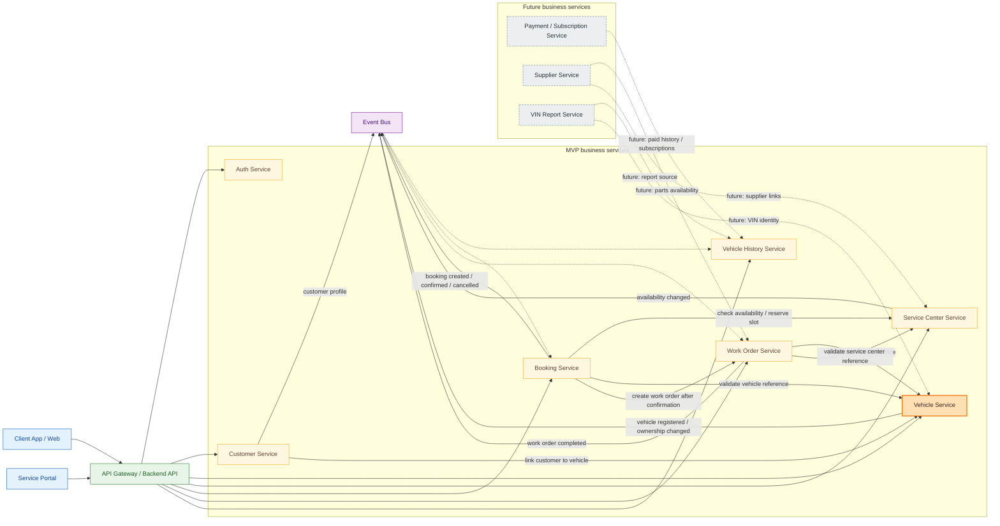

# PitGO Service Map

Эта схема показывает компактную архитектуру бизнес-сервисов PitGO. Это не ERD и не схема доменных сущностей: цель - быстро понять, какие части системы есть, как они связаны и где проходят границы ответственности.

## Архитектурное ревью текущей схемы

### Критические ошибки

1. **`Work Order Service --> History` как прямая команда или чтение чужих данных**  
   История автомобиля должна строиться из подтвержденных фактов о выполненных работах. Для микросервисной архитектуры корректнее публиковать событие `WorkOrderCompleted`, а `Vehicle History Service` должен подписываться на него.

2. **`History --> Vehicle` как зависимость владения историей от Vehicle API**  
   `Vehicle History Service` не должен ходить в `Vehicle Service` за каждой записью истории. Он хранит историю по `VehicleId` и может подписываться на события автомобиля, например `VehicleRegistered` или `VehicleOwnershipChanged`, если ему нужен локальный read model.

3. **`Vehicle Service` отвечает за "связь автомобиля с заявками и историей"**  
   Это размывает границы. `Vehicle Service` владеет идентичностью автомобиля, VIN и ownership lifecycle. Booking, work orders и history ссылаются на `VehicleId`, но не становятся частью Vehicle bounded context.

### Спорные решения

- `Booking --> WorkOrder` лучше трактовать не как жесткую зависимость, а как переход процесса: после подтверждения записи или приемки автомобиля создается work order. Это может быть синхронной командой в MVP, но событие `BookingConfirmed` лучше масштабируется.
- `CustomerSvc --> Vehicle` не должен означать владение автомобилями. Customer владеет профилем клиента, а Vehicle владеет автомобилем и связью ownership через `customerId`.
- `Payment / Subscription Service` и `Supplier Service` корректно вынесены в future. Для MVP они преждевременны.
- `VIN Reports` не обязательно отдельный сервис на старте. В будущем это может быть продуктовый слой поверх `Vehicle History Service`, пока лучше держать его как future capability.

## Улучшенная схема

## Обозначения

- Голубой - пользовательские приложения.
- Зеленый - API boundary.
- Желтый - MVP business services.
- Оранжевый - центральный `Vehicle Service`.
- Фиолетовый - event-driven integration.
- Серый пунктир - future services.
- Сплошные стрелки - синхронные запросы/команды через API, когда сервису нужен ответ сейчас.
- Пунктирные стрелки от `Event Bus` - реакция на бизнес-события без прямого доступа к данным другого сервиса.
- Каждый сервис владеет своими данными. Другие сервисы хранят только идентификаторы и необходимые локальные read models.

## Блоки

**Client App / Web**  
Клиентское приложение для владельца автомобиля: поиск СТО, запись на свободное окно, просмотр автомобиля и доступ к истории обслуживания.

**Service Portal**  
Кабинет СТО: календарь, заявки, статусы работ, автомобили клиентов и фиксация выполненных работ.

**API Gateway / Backend API**  
Единая точка входа для клиентского приложения и портала СТО. Не содержит бизнес-логику, только маршрутизацию, auth context и API composition.

**Auth Service**  
Регистрация, логин и роли пользователей: `customer`, `service_owner`, `service_employee`, `admin`. Не должен владеть профилями клиентов или СТО.

**Customer Service**  
Владеет профилем клиента и customer lifecycle. Связь с автомобилем выражается через ссылку на `VehicleId`, но техническая история автомобиля здесь не хранится.

**Vehicle Service**  
Центральный bounded context для идентичности автомобиля: `VehicleId`, VIN, базовая карточка и ownership lifecycle. Не владеет booking, work orders или историей обслуживания.

**Service Center Service**  
Владеет СТО: сотрудники, услуги, рабочие часы, правила доступности и свободные окна. Позже может обобщиться до provider/service-location модели для автомоек, детейлинга и автоэлектриков.

**Booking Service**  
Владеет процессом записи: выбранное время, клиент, автомобиль, СТО и статусы записи. Проверяет доступность у `Service Center Service` и публикует события изменения записи.

**Work Order Service**  
Владеет заказ-нарядом: работы, детали, стоимость и статусы ремонта. После завершения публикует событие, из которого строится история автомобиля.

**Vehicle History Service**  
Владеет историей обслуживания по `VehicleId`. Не редактирует заказ-наряды, а агрегирует подтвержденные факты из событий `Work Order Service` и других будущих источников.

**Event Bus**  
Интеграционный слой для бизнес-событий. Нужен, чтобы история автомобиля, будущие отчеты и другие read models не создавали жесткие синхронные связи между сервисами.

**Payment / Subscription Service**  
Не входит в MVP. Нужен позже для платного доступа к истории автомобиля, VIN-отчетам и подпискам сервисов.

**Supplier Service**  
Не входит в MVP. Нужен позже для поставщиков запчастей, наличия деталей и связи поставок с СТО и заказ-нарядами.

**VIN Report Service**  
Future capability поверх `Vehicle Service` и `Vehicle History Service`. Формирует отчеты по VIN на основе идентичности автомобиля и накопленной истории.

## Причины изменений

1. **История переведена на события**  
   История обслуживания является производным read model из подтвержденных работ. Это снижает связанность и сохраняет автономность `Work Order Service`.

2. **`Vehicle Service` очищен до identity/ownership context**  
   Автомобиль остается центральным бизнес-объектом, но центральность не означает, что все данные физически принадлежат одному сервису.

3. **`Work Order Service` оставлен владельцем факта выполненной работы**  
   Историческая запись появляется только после завершения или подтверждения заказ-наряда, поэтому источник истины для работ - `Work Order Service`.

4. **`Customer Service` не владеет автомобилями**  
   Клиентский профиль и автомобиль имеют разные жизненные циклы. Автомобиль может менять владельцев, поэтому ownership должен быть в `Vehicle Service`.

5. **Добавлен `Event Bus` как бизнес-интеграционный блок**  
   Это не DevOps-инфраструктура в контексте схемы, а архитектурный способ показать event-driven связи между сервисами.

6. **Future-сервисы оставлены вне MVP**  
   `Payment`, `Supplier` и `VIN Report` важны для развития, но на первом этапе не нужны для проверки основной ценности: запись в СТО и накопление истории автомобиля.

## MVP полнота

Для первого этапа текущего набора достаточно:

- клиент может зарегистрироваться;
- клиент может добавить или выбрать автомобиль;
- клиент может найти СТО и свободное окно;
- клиент может записаться;
- СТО может обработать заявку и оформить заказ-наряд;
- завершенный заказ-наряд попадает в историю автомобиля.

Отдельный Notification Service можно добавить позже. Для MVP уведомления допустимо реализовать внутри `Booking Service` или как простой adapter, пока это не стало самостоятельным продуктовым процессом.
